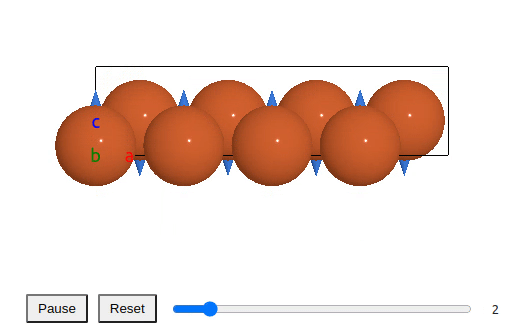

## Web Environment For Atomic Structure (WEAS)

[](https://www.npmjs.com/package/weas)
[](http://weas.readthedocs.io/)
[](https://github.com/superstar54/weas/actions/workflows/ci.yml)

The WEAS package is a JavaScript library designed to visualize and edit atomic structures (molecule, crystal, nanoparticle) in the web environments.

Features:

- Model: space-filling, ball-stick, polyhedral.
- Supported File types: cif, xyz, cube, xsf, POSCAR.
- Edit structure: move, rotate, delete, and replace atoms.
- Atom groups for tagging and selection by group.
- Support periodic boundary conditions.
- Animation (view and edit).
- Volumetric data (isosurface).
- Vector fields, e.g., magnetic moment.
- Import/export structures (JSON/XYZ/CIF) from the GUI.

### Demo

Here are some demo pages:

- [Codepen Demo](https://codepen.io/superstar54/full/MWRgKaG)
- ...

### How to use

Please visit: [WEAS Documentation](https://weas.readthedocs.io/en/latest/index.html)

### Viewer state and history

WEAS separates viewer state changes from operations that record undo/redo.

```js
// Apply state changes without history, with deferred redraws.
viewer.avr.transaction(() => {
  viewer.avr.applyState({ modelStyle: 1, colorBy: "Element" });
});

// Apply state changes with history.
viewer.avr.setState({ colorBy: "Index" }, { record: true, redraw: "full" });
```

### Save and restore state

You can export the full viewer state (atoms, plugins, viewer settings, camera) to JSON
and import it later.

```js
const snapshot = viewer.exportState();
// persist snapshot as JSON
const payload = JSON.stringify(snapshot);
// restore later
viewer.importState(JSON.parse(payload));
```

### Import/export structures

The GUI includes import/export buttons for JSON/XYZ/CIF. You can also use the
helpers programmatically:

```js
import { parseStructureText, applyStructurePayload, buildExportPayload, downloadText } from "weas";

const parsed = parseStructureText(text, ".cif");
applyStructurePayload(viewer, parsed.data);

const payload = buildExportPayload(viewer, "xyz");
downloadText(payload.text, payload.filename, payload.mimeType);
```

### Examples

### Molecule


### Crystal structure


#### Isosurfaces


#### Volume Slice


#### Animation


#### Phonons



### How to run a demo locally

Clone the repository,

```console
npm install
npm start
```

Then go to the `demo` site.

### Test

```console
npm install
npm test
```

#### End-to-end test

Use [playwright](https://playwright.dev/docs/intro) for the e2e test.

For the first time, one needs to install the dependence.

```
npx playwright install
```

Then run

```
npm run build
npx playwright test
```

Run the test with the title

```
npx playwright test -g "Animation"
```

If the snapshots need to be updated:

```
npx playwright test --update-snapshots
```

### Contact

- Xing Wang <xingwang1991@gmail.com>
