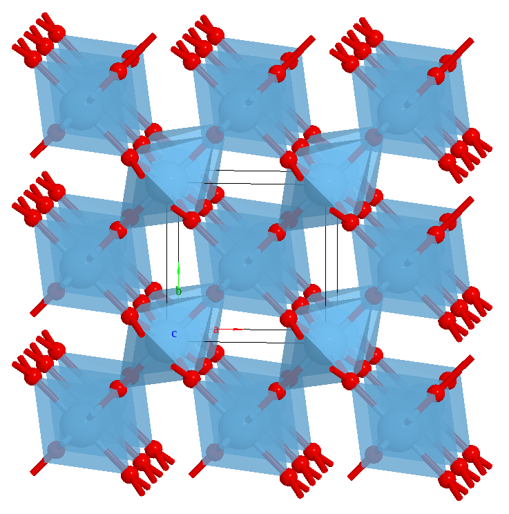
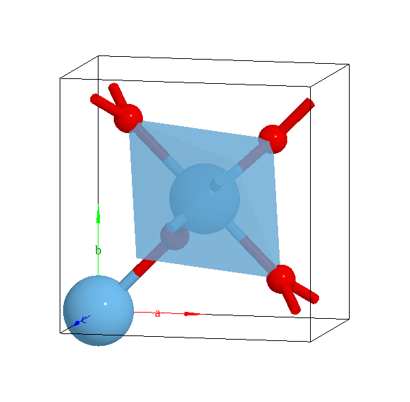
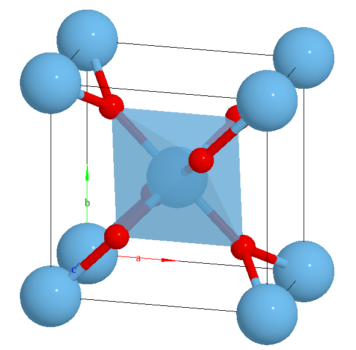

===================
Boundary mode
===================

The ``boundary`` key is used to show image atoms outside the cell. The default value is `[[0, 1], [0, 1], [0, 1]]`, thus no atoms outside the cell will be shown.

It has two purposes:

 - For the visualization of a crystal, one usually shows the atoms on the unit cell boundary.
 - In the DFT calculation, the periodic boundary condition (PBC) is very common. When editing a structure, one may want to see the how the PBC image atoms change.

Show the atoms on the unit cell:

.. code-block:: javascript

    editor.avr.boundary = [
        [-0.01, 1.01],
        [-0.01, 1.01],
        [-0.01, 1.01],
      ];

.. list-table::
   :widths: 50 50

   * - No boundary atoms
     - With boundary atoms
   * -  |no_boundary|
     -  |boundary|

Supercell view
----------------

.. code-block:: python

    editor.avr.boundary = [[-1, 2], [-1, 2], [-1, 2]]

