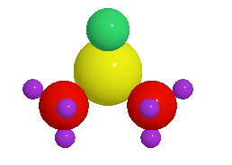

Color
===============

One can color the atoms using the following scheme:

- Element
- Random
- Uniform
- Index
- Attribute

Color by element
----------------

Supported style are:

#. **JMOL**: http://jmol.sourceforge.net/jscolors/#color_U
#. **VESTA**: https://jp-minerals.org/vesta/en/
#. **CPK**: https://en.wikipedia.org/wiki/CPK_coloring

-----------------------------
Custom color for each species
-----------------------------
Use can set custom color for each species. The color can be in the form of hex code or color name.

.. code-block:: javascript

    weas.avr.set_attribute("color", {C: "red", H: "#b434eb", O: "#34eb77", S: "#FFFF00" }, "species")
    weas.avr.drawModels()

Color by attribute
-----------------------
Coloring based on the attribute of the atoms. The attribute can be: charge, magmom, or any other attribute in the structure.

Here we show how to color the atoms by their forces.

.. code-block:: javascript

    weas.avr.colorBy = "Force"
    weas.avr._colorRamp = ["red", "yellow", "blue"]

.. image:: ../_static/images/example_color_by_force.png
   :width: 10cm
