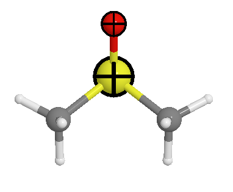

Highlight atoms
===============

One can highlight the atoms using the following shapes:

- sphere
- box
- cross

One can see the highlight setting:

.. code-block:: javascript

    editor.avr.highlightManager.settings

The default settings has a `selection` item, which is used to highlight the selected atoms.

Add highlight item
-------------------
One can add one highlight item:

.. code-block:: javascript

    // highlight the first two atoms with a cross, e.g., show the atoms which are fixed
    editor.avr.highlightManager.settings['fixed'] = {indices: [0, 1], type: 'cross'};
    editor.avr.highlightManager.drawHighlightAtoms()

