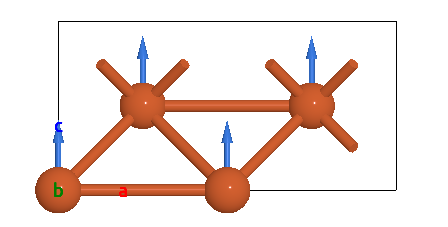
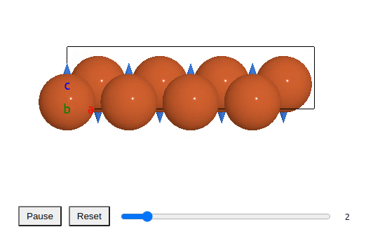

Vector Field Module
=================

This module contains classes for creating and managing vector fields.

Usage Example
-------------

.. code-block:: javascript

    let domElement = document.getElementById("viewer");
    // read atoms from file
    const filename = "c2h6so.xyz";
    fetchFile(filename).then((fileContent) => {
        const atoms = weas.parseXYZ(fileContent);
        atoms[0].newAttribute("moment", [1, 1, 1, 1, 1, -1, -1, -1, -1, -1], "atom");
        const editor = new weas.WEAS({ domElement });
        editor.avr.atoms = atoms;
        editor.avr.tjs.updateCameraAndControls({ direction: [0, 1, 0] });
        editor.avr.drawModels();
        editor.render();
    });

Magentic moment visualization
-----------------------------
The viewer has a default method to visualize the magnetic moment of atoms. One only needs to add the magnetic moment as an attribute to the atoms.

.. code-block:: javascript

    atoms.newAttribute("moment", [1, 1, 1, 1, 1, -1, -1, -1, -1, -1]);

Interactive phonon visualization
--------------------------------
In order to update the vector fields when the atom is moved in a animation, the data of vector fields should be read from the atoms attributes.

.. code-block:: javascript

    // calculate the movement of atoms based on the egenvectors and amplitude
    // then add the movement to the atoms attributes
    atoms.newAttribute("movement", movement);
    // Read orgins and vectors from atoms attributes
    editor.avr.VFManager.addSetting({ origins: "positions", vectors: "movement", color: "#ff0000", radius: 0.1 });
    editor.avr.VFManager.drawVectorFields();

