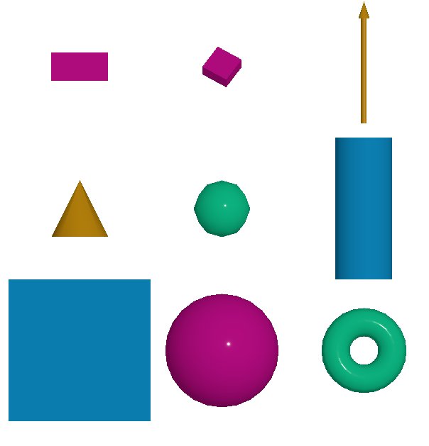

Mesh Primitive
=================
This module allow user to draw custom geometry. The supported geometry are:

- plane
- box
- sphere
- cylinder
- icosahedron
- cone
- torus
- arrow

Example
-----------------------------
The following example shows how to draw a cube and a sphere.

.. code-block:: JavaScript

    let domElement = document.getElementById("viewer");
    let editor = new weas.WEAS({ domElement });
    editor.ops.mesh.AddCubeOperation({ position: [-5, 0, 0], size: 2 });
    editor.ops.mesh.AddSphereOperation({ position: [5, 2, 0], radius: 2, color: "#00FF00" });
    editor.ops.hideGUI();
    editor.render();

Instance methods (Fast)
~~~~~~~~~~~~~~~~~~~~~~~~~
If you want to draw hundreds of cubes, spheres, or any other geometry, you can use the instancedMeshPrimitive object. This object allows you to draw multiple instances of the same geometry with different positions, scales, and colors.
The following example shows how to use the mesh primitive to draw two cubes and a sphere.

The following example shows how to draw two cubes and a cylinder.

.. literalinclude:: _examples/mesh_primitive.html
   :language: html

Here is the result of the above code:

.. raw:: html
  :file: _examples/mesh_primitive.html

Primitive Parameters
-----------------------------

Cube
~~~~~~~~~~~~~~~~~~~~~~~~~~~
The cube is defined by the following parameters:

.. code-block:: JavaScript

    {
     "positions": [0, 0, 0],
     "size": 2,
     "scale": [1, 1, 1],
     "rotation":[0, 0, 0],
     "color": "#bd0d87",
     "materialType": "Standard",
    }

Cylinder
~~~~~~~~~~~~~~~~~~~~~~~~~~~
The cylinder is defined by the following parameters:

.. code-block:: JavaScript

    {
     "positions": [0, 0, 0],
      "segments": 12,
      "radius": 1,
      "depth": 2,
      "scale": [1, 1, 1],
      "rotation":[0, 0, 0],
      "color": "#bd0d87",
    }

Sphere
~~~~~~~~~~~~~~~~~~~~~~~~~~~
The sphere is defined by the following parameters:

.. code-block:: JavaScript

    {
     "positions": [0, 0, 0],
      "widthSegments": 8,
      "heightSegments": 6,
      "radius": 1,
      "scale": [1, 1, 1],
      "rotation":[0, 0, 0],
      "color": "#bd0d87",
    }

Plane
~~~~~~~~~~~~~~~~~~~~~~~~~~~
The plane is defined by the following parameters:

.. code-block:: JavaScript

    {
     "positions": [0, 0, 0],
      "size": 2,
      "scale": [1, 1, 1],
      "rotation":[0, 0, 0],
      "color": "#bd0d87",
    }

Icosahedron
~~~~~~~~~~~~~~~~~~~~~~~~~~~
The icosahedron is defined by the following parameters:

.. code-block:: JavaScript

    {
     "positions": [0, 0, 0],
      "radius": 1,
      "detail": 2,
      "scale": [1, 1, 1],
      "rotation":[0, 0, 0],
      "color": "#bd0d87",
    }

Cone
~~~~~~~~~~~~~~~~~~~~~~~~~~~
The cone is defined by the following parameters:

.. code-block:: JavaScript

    {
     "positions": [0, 0, 0],
      "segments": 8,
      "radius": 1,
      "height": 2,
      "scale": [1, 1, 1],
      "rotation":[0, 0, 0],
      "color": "#bd0d87",
    }

Arrow
~~~~~~~~~~~~~~~~~~~~~~~~~~~
The arrow is defined by the following parameters:

.. code-block:: JavaScript

    {
     "positions": [0, 0, 0],
      "direction": [0, 0, 1],
      "length": 1,
      "color": "#bd0d87",
      "materialType": "Standard",
    }

Torus
~~~~~~~~~~~~~~~~~~~~~~~~~~~
The torus is defined by the following parameters:

.. code-block:: JavaScript

    {
     "positions": [0, 0, 0],
      "radius": 1,
      "tube": 0.4,
      "radialSegments": 8,
      "tubularSegments": 6,
      "scale": [1, 1, 1],
      "rotation":[0, 0, 0],
      "color": "#bd0d87",
    }

.. tip::
    Please check the `three.js documentation <https://threejs.org/manual/?q=primi#en/primitives>`_ for more information about the parameters.
